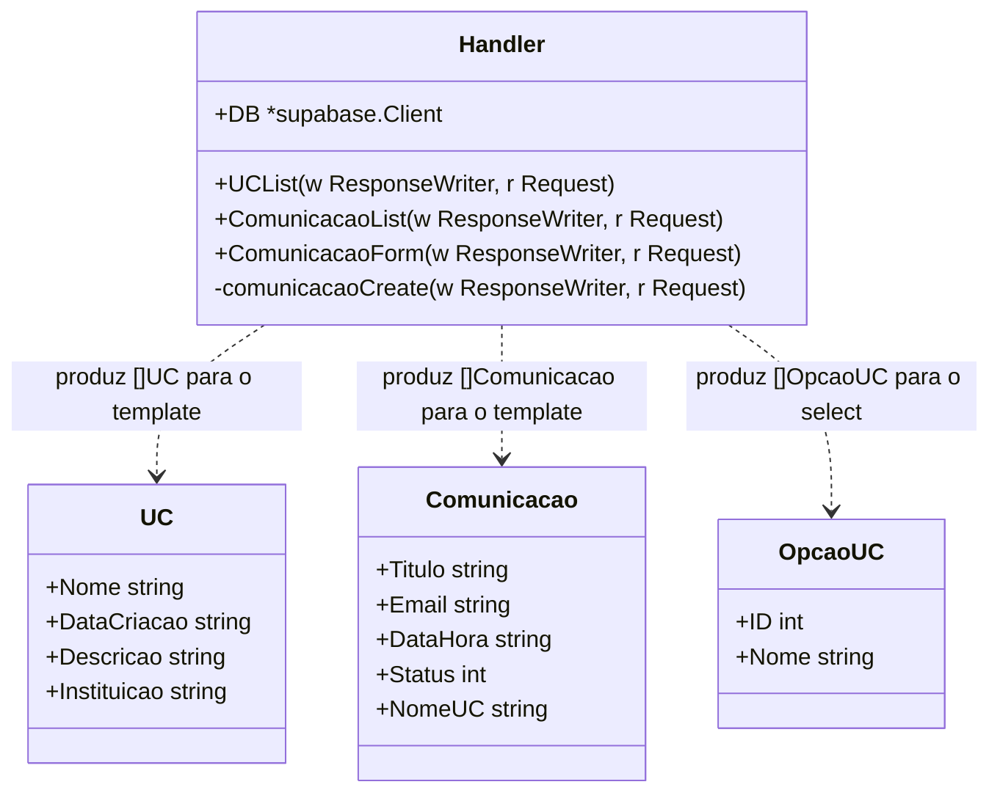
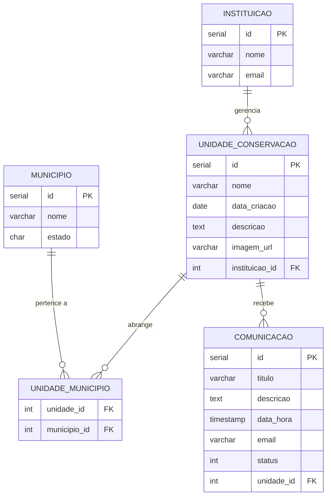

# HOW VI — Sistema de Unidades de Conservação

Trabalho prático da disciplina **Oficinas de Integração VI** — ADS UNIVALI.

Aplicação web desenvolvida em **Go puro** (sem framework) com banco de dados **Supabase (PostgreSQL na nuvem)**, rodando em ambiente **DevContainer** (Docker + VS Code).

---

## Funcionalidades

| Rota | Descrição |
|------|-----------|
| `GET /ucs` | Lista todas as Unidades de Conservação com a instituição responsável |
| `GET /comunicacoes` | Lista todas as comunicações registradas com status (Pendente/Atendida) |
| `GET /comunicacoes/nova` | Formulário para registrar nova comunicação |
| `POST /comunicacoes/nova` | Grava a comunicação no banco e redireciona para a lista |

---

## Stack

```
┌────────────────────────────────────────────┐
│  Browser (cliente)                          │
│     ↕  HTTP (GET / POST)                   │
├────────────────────────────────────────────┤
│  Go net/http  →  handlers  →  html/template │
│  (servidor web, sem framework)              │
├────────────────────────────────────────────┤
│  supabase-go  →  PostgREST API (HTTPS/443) │
├────────────────────────────────────────────┤
│  Supabase (PostgreSQL na nuvem)            │
└────────────────────────────────────────────┘
```

### Por que Go sem framework?

Em Spring Boot (`@GetMapping`, `@Controller`) o framework faz muita "magia" — roteamento, injeção de dependências, serialização — de forma invisível. Em Go, escrevemos tudo explicitamente. Isso parece trabalhoso no início, mas tem um benefício importante: você entende exatamente o que cada linha faz, o que torna possível escolher, adaptar ou construir um framework quando necessário.

### Por que Supabase em vez de PostgreSQL local?

O Supabase é PostgreSQL hospedado na nuvem. Em vez de manter um container de banco de dados local (que ocupa memória, precisa de migrate, etc.), conectamos diretamente ao serviço remoto via HTTPS. O `supabase-go` usa a API **PostgREST** do Supabase — não abre porta TCP 5432, o que evita problemas de firewall em redes corporativas e simplifica o `docker-compose.yml`.

### Por que DevContainer?

DevContainer = o ambiente de desenvolvimento roda **dentro de um container Docker**. Isso garante que todos os colaboradores têm exatamente as mesmas ferramentas (`air`, `goose`, `sqlc`, `go 1.26`) independente do sistema operacional do host. É o equivalente de uma "configuração padronizada de estação de trabalho" — todos navegam com o mesmo equipamento.

---

## Estrutura do Projeto

```
uc/
├── .devcontainer/
│   ├── Dockerfile          # imagem Go 1.26 Alpine + ferramentas (air, goose, sqlc)
│   ├── devcontainer.json   # configuração do VS Code dentro do container
│   └── setup-ssh.sh        # copia chaves SSH do host → container (para git push)
├── .env                    # credenciais (NÃO vai pro Git — ver .gitignore)
├── .gitignore
├── docker-compose.yml      # sobe apenas o container `app` (banco fica no Supabase)
├── go.mod                  # módulo Go: declara nome, versão e dependências
├── go.sum                  # checksums das dependências (não editar manualmente)
├── main.go                 # ponto de entrada: conecta ao banco, registra rotas, sobe servidor
├── internal/
│   ├── db/
│   │   └── db.go           # cria e retorna o cliente Supabase
│   └── handlers/
│       ├── uc.go           # handler GET /ucs  +  structs Handler e UC
│       └── comunicacao.go  # handlers GET/POST /comunicacoes/nova e GET /comunicacoes
└── templates/
    ├── base.html           # layout HTML reutilizável (nav, head, body)
    ├── uc_list.html        # tabela de unidades de conservação
    ├── comunicacao_form.html   # formulário de nova comunicação
    └── comunicacao_list.html  # tabela de comunicações com status colorido
```

---

## Diagrama de Classes (structs Go)



> Os "objetos" em Go são **structs** (não classes). Não há herança — apenas composição. Os métodos são definidos com **receivers** (`func (h *Handler) UCList(...)`), equivalente aos métodos de instância em Java.

---

## DER — Diagrama Entidade-Relacionamento



> `UNIDADE_MUNICIPIO` é uma **tabela associativa** (N:N entre UC e Município). Uma UC pode abranger vários municípios, e um município pode ter várias UCs.

---

## DDL — Criação das Tabelas (PostgreSQL / Supabase)

Execute no **SQL Editor do Supabase** na ordem abaixo (respeitar a ordem das foreign keys):

```sql
-- 1. Instituição responsável pela UC
CREATE TABLE instituicao (
  id    SERIAL PRIMARY KEY,
  nome  VARCHAR(150) NOT NULL,
  email VARCHAR(150) NOT NULL UNIQUE
);

-- 2. Unidade de Conservação
CREATE TABLE unidade_conservacao (
  id             SERIAL PRIMARY KEY,
  nome           VARCHAR(150) NOT NULL,
  data_criacao   DATE         NOT NULL,
  descricao      TEXT,
  imagem_url     VARCHAR(255),
  instituicao_id INT          NOT NULL REFERENCES instituicao(id)
);

-- 3. Município
CREATE TABLE municipio (
  id     SERIAL PRIMARY KEY,
  nome   VARCHAR(150) NOT NULL,
  estado CHAR(2)      NOT NULL
);

-- 4. Tabela associativa UC ↔ Município (N:N)
CREATE TABLE unidade_municipio (
  unidade_id   INT NOT NULL REFERENCES unidade_conservacao(id),
  municipio_id INT NOT NULL REFERENCES municipio(id),
  PRIMARY KEY (unidade_id, municipio_id)
);

-- 5. Comunicações da população sobre as UCs
CREATE TABLE comunicacao (
  id         SERIAL PRIMARY KEY,
  titulo     VARCHAR(150) NOT NULL,
  descricao  TEXT         NOT NULL,
  data_hora  TIMESTAMP    NOT NULL,
  email      VARCHAR(150) NOT NULL,
  status     INT          NOT NULL DEFAULT 0,
  unidade_id INT          NOT NULL REFERENCES unidade_conservacao(id)
);
```

> **Nota:** O arquivo `material/UnidadeConservacao.sql` usa sintaxe **MySQL** (`AUTO_INCREMENT`, `DATETIME`). O DDL acima é a versão adaptada para **PostgreSQL** (`SERIAL`, `TIMESTAMP`).

---

## DML — Dados de Exemplo

```sql
-- Instituições
INSERT INTO instituicao (nome, email) VALUES
('ICMBio', 'icmbio@org.br'),
('IMA SC', 'ima@sc.gov.br');

-- Municípios
INSERT INTO municipio (nome, estado) VALUES
('Florianopolis', 'SC'),
('Balneario Camboriu', 'SC'),
('Itajai', 'SC'),
('Bombinhas', 'SC');

-- Unidades de Conservação
INSERT INTO unidade_conservacao (nome, data_criacao, descricao, imagem_url, instituicao_id) VALUES
('Parque do Rio Vermelho', '2007-03-24', 'Area de preservacao ambiental',      'img1.jpg', 2),
('Parque Raimundo Malta',  '1993-07-15', 'Parque com trilhas e vegetacao nativa','img2.jpg', 2),
('Reserva do Arvoredo',    '1990-04-12', 'Reserva marinha protegida',           'img3.jpg', 1),
('Parque da Ressacada',    '2008-09-10', 'Area voltada para educacao ambiental', 'img4.jpg', 2);

-- Relação UC ↔ Município
INSERT INTO unidade_municipio (unidade_id, municipio_id) VALUES
(1, 1),  -- Rio Vermelho → Florianópolis
(2, 2),  -- Raimundo Malta → Balneário Camboriú
(3, 1),  -- Arvoredo → Florianópolis
(3, 4),  -- Arvoredo → Bombinhas  (UC em 2 municípios)
(4, 3);  -- Ressacada → Itajaí

-- Comunicações iniciais
INSERT INTO comunicacao (titulo, descricao, data_hora, email, status, unidade_id) VALUES
('Lixo na trilha',  'Tem lixo acumulado em alguns pontos',  '2026-04-20 10:30:00', 'user1@email.com', 0, 1),
('Placa quebrada',  'Uma placa informativa esta danificada', '2026-04-21 14:00:00', 'user2@email.com', 1, 2),
('Pesca irregular', 'Possivel atividade ilegal na area',    '2026-04-22 09:15:00', 'user3@email.com', 0, 3);
```

> `status = 0` → Pendente | `status = 1` → Atendida

---

## Como Rodar o Projeto

### Pré-requisitos

- [Docker Desktop](https://www.docker.com/products/docker-desktop/) instalado
- [VS Code](https://code.visualstudio.com/) com a extensão **Dev Containers** (`ms-vscode-remote.remote-containers`)
- Conta no [Supabase](https://supabase.com) com o banco criado e o DDL executado

### 1. Configure o `.env`

Crie o arquivo `uc/.env` (não vai pro Git):

```bash
# Pegue em: Supabase → Settings → API → Project URL
DATABASE_URL=https://xxxxxxxxxxxx.supabase.co

# Pegue em: Supabase → Settings → API → anon/public key
DATABASE_KEY=eyJhbGci...

PORT=8180
```

> `DATABASE_URL` deve ser **apenas o domínio** do projeto Supabase, sem `/rest/v1` no final.

### 2. Abra no DevContainer

1. Abra a pasta `uc/` no VS Code
2. Quando aparecer o popup "Reopen in Container", clique nele
3. (Ou: `Ctrl+Shift+P` → "Dev Containers: Reopen in Container")
4. Aguarde o Docker construir a imagem (~2 min na primeira vez)

### 3. Execute o servidor

No terminal **dentro do container**:

```bash
go run main.go
```

Acesse no browser: `http://localhost:8180/ucs`

---

## Conceitos Principais Ensinados

### 1. DevContainer e Docker Compose

O `docker-compose.yml` sobe apenas um serviço (`app`) — o container onde o Go roda. O banco fica no Supabase. O `Dockerfile` usa Alpine Linux (~200 MB vs ~1.5 GB do Debian) e pré-instala ferramentas:

- `air` — reinicia o servidor automaticamente ao salvar (equivalente ao Spring DevTools)
- `goose` — gerencia migrations de banco (próximo passo do projeto)
- `sqlc` — gera código Go a partir de queries SQL (próximo passo)

**Por que `go clean -modcache` no mesmo RUN do Dockerfile?**
O cache de módulos do Go é criado e removido na **mesma camada Docker**. Se o `clean` ficasse em outro `RUN`, a camada anterior com ~3 GB de dependências transitivas ficaria embedada na imagem mesmo após o clean.

### 2. Servidor HTTP em Go sem framework

```go
// Registrar rota → função handler
http.HandleFunc("/ucs", h.UCList)

// Subir servidor
log.Fatal(http.ListenAndServe(":8180", nil))
```

Todo handler tem a mesma assinatura:
- `w http.ResponseWriter` → onde você **escreve** a resposta (canal de saída)
- `r *http.Request` → a requisição que chegou (URL, método, body, headers)

### 3. Templates HTML (`html/template`)

Go usa um sistema de **template herança** com `{{define}}` e `{{block}}`:

```
base.html          → define o layout geral (nav, head, body)
  └── uc_list.html → define apenas o "content" que vai dentro do layout
```

O handler carrega e executa os dois arquivos juntos:
```go
tmpl, _ := template.ParseFiles("templates/base.html", "templates/uc_list.html")
tmpl.ExecuteTemplate(w, "base", dados)
```

### 4. Dependency Injection em Go

Em vez de variáveis globais, usamos uma `struct` que "carrega" o cliente de banco, e os handlers viram **métodos** dessa struct:

```go
type Handler struct {
    DB *supabase.Client  // dependência injetada
}

func (h *Handler) UCList(w http.ResponseWriter, r *http.Request) {
    // h.DB disponível aqui sem global
}
```

No `main.go`:
```go
h := &handlers.Handler{DB: client}
http.HandleFunc("/ucs", h.UCList)
```

Em Spring Boot isso seria feito com `@Autowired`. Em Go, a injeção é **explícita** — sem magia, sem surpresas.

### 5. supabase-go e PostgREST

O `supabase-go` não abre conexão TCP com o PostgreSQL. Ele faz chamadas **HTTPS** para a API REST do Supabase (PostgREST). O JOIN via foreign key é feito pela sintaxe `"instituicao(nome)"` no Select:

```go
h.DB.From("unidade_conservacao").
    Select("nome, data_criacao, descricao, instituicao(nome)", "", false).
    Order("nome", &postgrest.OrderOpts{Ascending: true}).
    ExecuteTo(&rows)
```

Isso é equivalente ao SQL:
```sql
SELECT uc.nome, uc.data_criacao, uc.descricao, i.nome
FROM unidade_conservacao uc
JOIN instituicao i ON i.id = uc.instituicao_id
ORDER BY uc.nome ASC;
```

### 6. Padrão PRG (Post-Redirect-Get)

Após um POST bem-sucedido, o servidor **não renderiza HTML** — ele redireciona para um GET:

```
Browser → POST /comunicacoes/nova → INSERT no banco
        ← 303 See Other /comunicacoes
Browser → GET /comunicacoes → SELECT no banco → HTML
```

Isso evita que o usuário reenvie o formulário ao apertar F5.

```go
http.Redirect(w, r, "/comunicacoes", http.StatusSeeOther)
```

### 7. `godotenv.Overload()` vs `Load()`

`godotenv.Load()` não sobrescreve variáveis já existentes no ambiente. O Docker Compose injeta as variáveis do `.env` ao iniciar o container — se o `.env` for alterado depois, `Load()` ignora as mudanças. `Overload()` sempre usa o arquivo `.env` como fonte de verdade.

---

## Armadilhas Resolvidas

| Problema | Causa | Solução |
|----------|-------|---------|
| `git push` falha no container | `openssh-client` não instalado na imagem Alpine | Adicionar `openssh-client` no `apk add` do Dockerfile |
| Chaves SSH não encontradas | Container isolado, não enxerga `~/.ssh` do host | Montar `~/.ssh:/root/host-ssh:ro` + `setup-ssh.sh` copia e ajusta permissões |
| `pgx` não conecta ao Supabase | Supabase bloqueia TCP na porta 5432 externamente | Usar `supabase-go` que usa HTTPS/443 (PostgREST) |
| Erro PGRST125 "Invalid path" | `DATABASE_URL` continha `/rest/v1` — a lib adiciona esse sufixo internamente | `DATABASE_URL` deve ser só o domínio: `https://xxxx.supabase.co` |
| `.env` ignorado em runtime | `godotenv.Load()` não sobrescreve env já injetado pelo Docker | Usar `godotenv.Overload()` |
| Datas chegam como string | `supabase-go` usa JSON (PostgREST), não protocolo binário PostgreSQL | Parsear manualmente com `time.Parse` |

---

## Dependências

| Pacote | Versão | Função |
|--------|--------|--------|
| `github.com/joho/godotenv` | v1.5.1 | Carrega variáveis do arquivo `.env` |
| `github.com/supabase-community/supabase-go` | v0.0.4 | Cliente Supabase (wrapper sobre PostgREST) |
| `github.com/supabase-community/postgrest-go` | v0.0.11 | API PostgREST (query builder) — dependência do supabase-go |

---

## Próximos Passos (roadmap)

- [ ] `air` — hot reload automático no desenvolvimento
- [ ] `goose` — migrations versionadas do banco
- [ ] Middleware de logging e autenticação
- [ ] Goroutines — processamento concorrente (ex: enviar e-mail ao criar comunicação)
- [ ] `sqlc` — geração de código Go tipado a partir de queries SQL

---

## Material do Projeto

Os diagramas originais e o enunciado estão na pasta `../material/`:

```
material/
├── DiagramaDER.png          # DER original
├── DiagramaDeClasses.png    # Diagrama de classes original
├── SQL_DDL.png              # DDL em imagem
├── SQL_DML.png              # DML em imagem
├── UnidadeConservacao.sql   # DDL original (sintaxe MySQL)
├── InsereDados.sql          # DML com dados de exemplo
└── Enunciado do Trabalho.pdf
```
